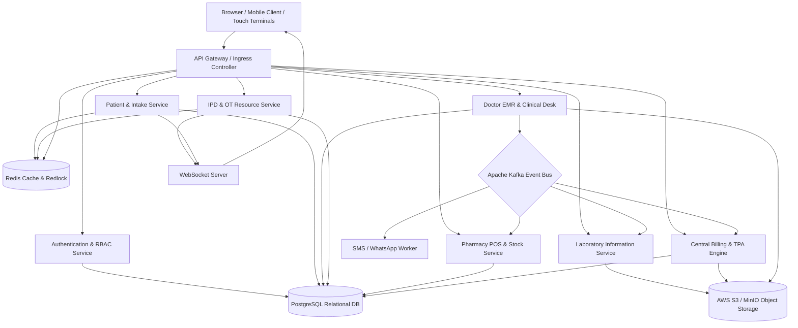

# CarePulse Hospital Management System (HMS)

Version: 2.4.0-Production | Standards: ABDM, HL7/FHIR, HIPAA Compliant | Architecture: Event-Driven Microservices

CarePulse is an enterprise-grade, modular, white-themed Hospital Management System designed for multi-specialty medical centers, healthcare networks, clinical practitioners, administrative staff, and patients. The platform unifies outpatient registration, emergency trauma triage, electronic medical records (EMR), inpatient ward allocation, surgical roster planning, laboratory diagnostics, pharmacy dispensing, cashless insurance claims, and patient self-service portals into a single, cohesive ecosystem.

---

## Table of Contents

1. Executive Summary
2. System Architecture and Data Pipeline
3. Technology Stack and Infrastructure Requirements
4. Module Directory and Production Interfaces
5. End-to-End Operational Lifecycle and Event Contracts
6. Role-Based Access Control (RBAC) and Security Model
7. Mobile Responsive Architecture
8. Universal System Navigator and Progress Tracker
9. Repository Directory Structure
10. Installation and Local Execution
11. Standards, Compliance, and Licensing

---

## 1. Executive Summary

Traditional healthcare facilities struggle with fragmented documentation, billing leakage across departmental handoffs, prolonged outpatient department (OPD) queue times, and uncoordinated inpatient bed availability.

CarePulse HMS resolves these operational challenges through:
- Unified Financial Ledger: Consolidates consultation fees, room tariffs, laboratory tests, and pharmacy billing items into an immutable master invoice, eliminating billing leakage.
- ABDM and ABHA Integration: Complies with the Ayushman Bharat Digital Mission by linking patient records to their Ayushman Bharat Health Account (ABHA) and Unique Hospital Identification (UHID).
- Event-Driven Decoupling: Decouples clinical encounters from downstream pharmacy and laboratory workflows using asynchronous event streaming.
- Sub-Millisecond Real-Time Updates: Delivers instant queue updates, emergency triage alarms, and live bed matrix changes via in-memory caching and WebSockets.

---

## 2. System Architecture and Data Pipeline

The system is organized as a decoupled, event-driven service mesh designed for high concurrency, zero data loss, and sub-second latency across all clinical counters.



---

## 3. Technology Stack and Infrastructure Requirements

### Core Infrastructure Components

#### 1. PostgreSQL (Primary Relational Database of Record)
- Role: Serves as the primary ACID-compliant transactional store.
- Target Tables: Patient demographic entities, clinical encounter history, ICD-10 medical diagnoses, digital prescriptions, drug catalog, and master billing ledgers.
- Concurrency Control: Uses row-level pessimistic locking (`SELECT ... FOR UPDATE`) during pharmacy drug dispensing to guarantee batch inventory integrity under concurrent requests.
- Target Version: PostgreSQL 15+ / 16 Enterprise.

#### 2. Redis (In-Memory Data Store, Cache, and Mutex)
- Role: Delivers sub-2ms latency for high-frequency volatile states without disk I/O bottlenecks.
- Responsibilities:
  - Live OPD Queue Ordering: Redis Sorted Sets (`ZADD`, `ZPOPMIN`) maintain real-time patient queue rankings per doctor room.
  - Concurrency Lock (Redlock Algorithm): Prevents simultaneous double-booking of ICU beds and Operation Theatre suites during emergency intake.
  - Session Management: Stores active OAuth2/JWT session states and manages API rate limits on authentication endpoints.
- Target Version: Redis Cluster 7.x.

#### 3. Apache Kafka (Distributed Event Streaming Platform)
- Role: Implements asynchronous pub/sub event contracts across independent microservices.
- Key Topics and Payloads:
  - `prescription.finalized`: Emitted when a physician electronically signs an E-Rx. Consumed concurrently by Pharmacy (order staging), Laboratory (sample order creation), and Billing (provisional ledger accumulation).
  - `triage.code-red`: Emitted during life-threatening emergency triage to broadcast instant alerts to resuscitation teams and pagers.
  - `appointment.booked`: Enqueues notification workers to dispatch automated SMS/WhatsApp appointment confirmation slips.
  - `patient.discharged`: Emitted on cashier clearance, releasing the ward bed back into housekeeping status.
- Target Version: Kafka 3.7+ / Strimzi Operator on Kubernetes.

#### 4. AWS S3 / MinIO (Encrypted Object Storage)
- Role: High-durability storage engine for unstructured binary medical files, isolating large documents from database tables.
- Stored Artifacts:
  - High-resolution PACS/DICOM radiology scans (Chest X-Rays, 128-slice CT scans, MRI imaging).
  - Pathologist-signed NABL laboratory diagnostic PDF reports.
  - Official patient discharge summaries and GST tax invoice receipts.
  - Digital ABHA QR identity cards for offline patient validation.
- Encryption Standard: Server-Side Encryption with AES-256 (SSE-S3).

#### 5. WebSockets (Native WS / Socket.io Protocol)
- Role: Full-duplex real-time bi-directional event transport between server and client terminals.
- Use Cases: Real-time waiting room display screens, live IPD ward bed occupancy matrix updates, and instant abnormal laboratory alarms sent to the attending physician screen.

#### 6. Elasticsearch (Fast Fuzzy Search Engine)
- Role: Delivers sub-20ms fuzzy search and autocomplete over 70,000+ ICD-10 diagnosis codes, pharmaceutical chemical formulas, and global patient UHID directories.

---

## 4. Module Directory and Production Interfaces

The repository contains 15 functional HTML5/CSS3/JavaScript interfaces configured for production deployment:

### Public and Patient-Facing Interfaces
- `landing.html`: Public hospital website featuring emergency dispatch banner, interactive appointment scheduler, 14 medical departments, doctor directory, and cashless insurance partners.
- `user_portal.html`: Full-featured patient health portal with digital ABHA identification card, active E-Prescriptions, downloadable NABL lab reports, daily medication reminder tracker, and cashless insurance invoices.
- `patient_portal.html`: Alternative lightweight patient self-service dashboard for fast appointment booking and historical consultation summaries.

### Clinical and Administrative Interfaces
- `dashboard.html`: Executive hospital dashboard monitoring 500-bed campus occupancy, daily revenue collections (UPI, Cash, Insurance), active admissions, and departmental turnaround times.
- `reception.html`: OPD front desk intake counter for patient demographic entry, UHID issuance, and doctor token queue generation.
- `emergency.html`: 24x7 Emergency and Trauma Triage module implementing the Manchester Triage Protocol with color-coded priority assignments (Red, Yellow, Green).
- `doctor_emr.html`: Doctor clinical consultation desk featuring patient history, vitals monitoring, ICD-10 disease search, and digital E-Prescription (E-Rx) generator.
- `ipd_beds.html`: Inpatient ward matrix with visual grid representations of ICU, General Ward, and Private Suites with live status flags (Occupied, Vacant, Cleaning).
- `operation_theatre.html`: Surgical OT roster managing multi-theatre scheduling, chief surgeon allocation, anesthesia verification, and PAC clearance.
- `laboratory.html`: Laboratory Information System (LIS) for specimen barcoding, sample collection tracking, and signed PDF diagnostic report generation.
- `blood_bank.html`: Blood inventory management system tracking ABO and Rh component stock, cross-matching, donor logs, and temperature alerts.
- `pharmacy.html`: Pharmacy Point of Sale (POS) and inventory dispensing desk with prescription auto-sync, batch tracking, and expiry management.
- `billing.html`: Centralized financial billing desk unifying doctor fees, bed occupancy, diagnostic tests, and pharmacy charges with Star Health cashless TPA claim settlement.
- `discharge.html`: Multi-department clearance gate pass system enforcing no-dues verification across Pharmacy, Laboratory, and Nursing before patient release.

### Architecture and Presentation Interfaces
- `requirements.html`: Interactive technical requirements and operational timeline explorer detailing database transactions, Redis locks, Kafka events, and RBAC rules.
- `index.html`: Interactive Figma-style visual architecture flow canvas mapping the complete hospital data flow.
- `slides.html`: Fullscreen slide deck configured for engineering and executive presentations.
- `hms_app.html`: Single-page application prototype uniting core hospital operations.

---

## 5. End-to-End Operational Lifecycle and Event Contracts

The hospital operations lifecycle executes in 8 discrete phases across specific frontend screens and backend infrastructure:

| Stage | Frontend Interface | Operational Trigger | Backend Infrastructure | Kafka Event Topic |
| :--- | :--- | :--- | :--- | :--- |
| **1. Pre-Hospital** | `landing.html` / `user_portal.html` | Patient books appointment | Redis Slot Lock + PostgreSQL Write | `appointment.booked` |
| **2. Intake & Triage** | `reception.html` / `emergency.html` | Patient arrives at facility | PostgreSQL UHID Sequence + Redis ZADD | `patient.arrived` / `triage.code-red` |
| **3. Doctor EMR** | `doctor_emr.html` | Token called to cabin | Elasticsearch ICD-10 + PostgreSQL E-Rx | `prescription.finalized` |
| **4. Diagnostics** | `laboratory.html` / `blood_bank.html` | Tests or blood ordered | Kafka Consumer + AWS S3 Storage | `lab.report-verified` |
| **5. IPD / Surgery** | `ipd_beds.html` / `operation_theatre.html` | Patient admitted or scheduled | Redis Redlock Mutex + WebSockets Sync | `bed.allocated` / `surgery.scheduled` |
| **6. Pharmacy** | `pharmacy.html` | Prescription dispensed | PostgreSQL `FOR UPDATE` Row Lock | `inventory.deducted` |
| **7. Discharge** | `billing.html` / `discharge.html` | Treatment concluded | PostgreSQL Master Ledger + S3 PDF | `patient.discharged` |
| **8. Post-Care** | `user_portal.html` | At-home patient recovery | ABDM FHIR Network + S3 Pre-signed URLs | `portal.report-downloaded` |

---

## 6. Role-Based Access Control (RBAC) and Security Model

Access permissions are enforced through OAuth 2.0 and cryptographically signed JSON Web Tokens (JWT) containing scoped role claims:

| User Role | JWT Claim Scope | Permitted Capabilities | Prohibited Boundaries | Primary Interface |
| :--- | :--- | :--- | :--- | :--- |
| **Patient** | `role:patient` | Read personal E-Rx, lab reports, invoices | Prohibited from viewing other patient files or internal clinical notes | `user_portal.html` |
| **Receptionist** | `role:frontdesk` | Create patient entities, generate OPD tokens | Prohibited from viewing doctor diagnostic notes or lab test values | `reception.html` |
| **Emergency Nurse** | `role:triage_nurse` | Log emergency vitals, assign triage priority | Prohibited from altering physician diagnoses or modifying cashier discounts | `emergency.html` |
| **Doctor / Physician** | `role:doctor` | Full EMR write access, lab orders, E-Rx sign | Prohibited from accessing cashier cash drawers or waiving invoice fees | `doctor_emr.html` |
| **Floor Nurse** | `role:inpatient_nurse`| Bed assignment, shift vitals logging | Prohibited from discharging patients without physician and cashier clearance | `ipd_beds.html` |
| **Surgeon** | `role:surgeon_ot` | Surgical roster scheduling, anesthesia review | Prohibited from modifying general outpatient billing ledgers | `operation_theatre.html` |
| **Lab Technician** | `role:lis_technician` | Scan vial barcodes, enter diagnostic findings | Prohibited from modifying medical prescriptions or dispensing pharmaceuticals | `laboratory.html` |
| **Pharmacist** | `role:pharmacist` | Scan drug batches, deduct inventory | Prohibited from altering physician prescription chemical formulas | `pharmacy.html` |
| **Billing Officer** | `role:billing_finance`| Consolidate ledger, process cashless claims | Prohibited from editing physician diagnostic data or clinical encounter notes | `billing.html` |
| **Hospital Director** | `role:superadmin` | Executive KPI analytics, financial audit logs | Full visibility backed by immutable Kafka audit stream | `dashboard.html` |

---

## 7. Mobile Responsive Architecture

CarePulse HMS is engineered to operate reliably across all device viewports, from compact 360px smartphones (iPhone 16, Samsung Galaxy) to multi-monitor clinical workstations.

### Responsive Engineering Rules
- Root Overflow Containment: Strict `overflow-x: clip` applied on `html`, `body`, `.app-wrapper`, and `.main-content` to prevent horizontal viewport drift.
- Adaptive Topbars: Secondary badges and lengthy text truncate automatically via `text-overflow: ellipsis` on viewports narrower than 576px.
- Touch Navigation Drawer: Offcanvas sidebar drawer featuring swipe-to-close gestures, backdrop blur, and auto-dismiss on route selection.
- Mobile Bottom Navigation: Fixed 60px bottom quick-access bar providing 1-tap navigation between Home, OPD, EMR, Bed Matrix, and the Menu Drawer.
- Data Table Handling: Responsive wrapper classes (`.table-responsive`) maintain internal horizontal scrollability for data grids without breaking page-level boundaries.

---

## 8. Universal System Navigator and Progress Tracker

All pages incorporate the CarePulse System Navigator (`js/navigator.js`), accessible via the header compass button or the `Alt + N` keyboard shortcut.

### Navigator Capabilities
- Real-Time Location Indicator: Displays the exact name, filename, and module category of the active screen.
- 1-Click Page Switcher: Categorized grid organizing all 15 screens for seamless transitions during demonstrations.
- Sprint Roadmap Tracker: Displays live progress across completed deliverables (15/15 UI screens, responsive engine, cross-linking) and upcoming phases (Backend REST API endpoints, PostgreSQL database hookup, SMS/WhatsApp notification gateway, biometric hardware integration).

---

## 9. Repository Directory Structure

```
hospital_managment_system/
|-- css/
|   `-- style.css              # Core design tokens, clean white theme, mobile media queries
|-- js/
|   |-- mobile.js             # Mobile touch gestures, drawer engine, bottom navigation
|   `-- navigator.js          # Universal system navigator, page tracker, roadmap modal
|-- billing.html              # Centralized invoicing and cashless TPA insurance desk
|-- blood_bank.html           # Blood bank inventory, cross-match, and donor management
|-- dashboard.html            # Executive hospital KPI analytics dashboard
|-- discharge.html            # Multi-department discharge clearance and gate pass
|-- doctor_emr.html           # Doctor clinical consultation desk and E-Prescription
|-- emergency.html            # 24x7 Emergency and Trauma triage (Manchester Protocol)
|-- hms_app.html              # Integrated single-page application prototype
|-- index.html                # Interactive Figma-style visual architecture canvas
|-- ipd_beds.html             # Inpatient bed management and ward matrix
|-- laboratory.html           # Laboratory Information System (LIS) and test verification
|-- landing.html              # Public-facing hospital portal and appointment widget
|-- operation_theatre.html    # OT surgical roster and operating room scheduling
|-- patient_portal.html       # Lightweight patient self-service dashboard
|-- pharmacy.html             # Pharmacy POS, prescription dispensing, and stock control
|-- reception.html            # OPD reception counter, UHID registration, and token issue
|-- requirements.html         # Technical architecture and system requirements explorer
|-- slides.html               # Fullscreen slide deck for technical team presentations
|-- PRESENTATION_GUIDE.md     # Comprehensive engineering documentation and presentation script
`-- README.md                 # System technical specifications and repository handbook
```

---

## 10. Installation and Local Execution

The frontend is built with vanilla HTML5, Bootstrap 5.3, and modern ECMAScript, requiring zero build steps or package installations.

### Option 1: Direct File Execution
Double-click any HTML interface (e.g., `landing.html` or `dashboard.html`) to launch directly inside any modern web browser.

### Option 2: Live Server (VS Code / Antigravity IDE)
Right-click `landing.html` or `dashboard.html` and choose "Open with Live Server" (default address: `http://localhost:5500`).

### Option 3: Python Built-In HTTP Server
Open a terminal in the project root directory and execute:
```bash
python -m http.server 5500
```
Then navigate to:
- Technical Architecture Explorer: `http://localhost:5500/requirements.html`
- Executive Dashboard: `http://localhost:5500/dashboard.html`
- Public Landing Page: `http://localhost:5500/landing.html`
- Patient Health Portal: `http://localhost:5500/user_portal.html`

---

## 11. Standards, Compliance, and Licensing

- Ayushman Bharat Digital Mission (ABDM): Compliant with Milestone 1 (M1 - ABHA Creation), Milestone 2 (M2 - Health Facility Registry), and Milestone 3 (M3 - Health Information Exchange).
- Health Level Seven International (HL7 / FHIR): Data exchange structures aligned with FHIR R4 resource definitions (`Patient`, `Encounter`, `Condition`, `MedicationRequest`, `Observation`).
- HIPAA Security Rule: Architecture enforces encryption in transit (TLS 1.3), encryption at rest (AES-256), and immutable audit logging via Kafka.
- Licensing: Licensed for enterprise development, commercial adaptation, and healthcare facility deployment under organizational guidelines. For technical customizations, refer to `PRESENTATION_GUIDE.md`.
